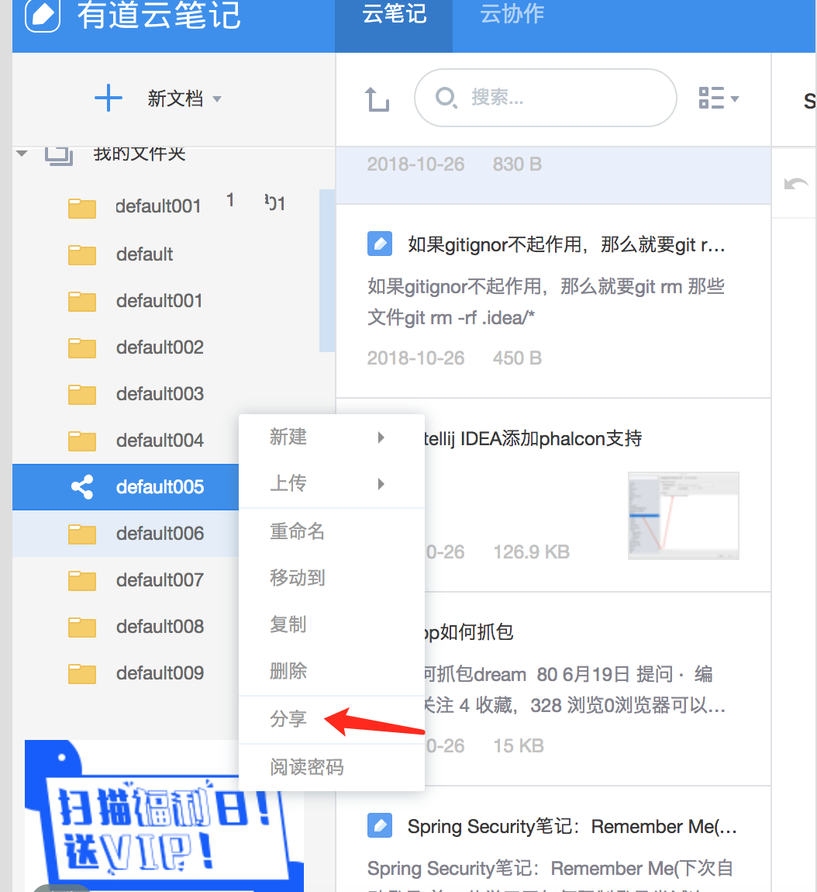
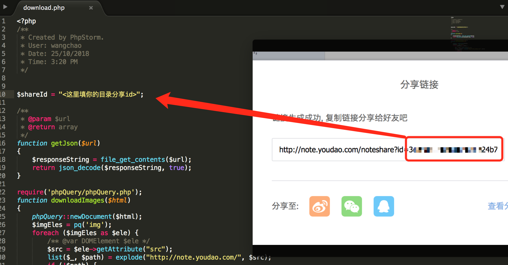

# 导出有道笔记

脚本只能导出分享目录下的笔记 而且只对改目录下一级笔记导出，如果被分享目录有多层目录需要多次分享该目录，

要导出笔记，需要进行如下步骤：

- 选择要导出的目录，分享它

- 获取分享id，并把id赋值到`download.php`里的`$shareId`

- 执行命令 `php download.php`

ps： 如果笔记里包含敏感词（`tc`、`机器学习`、`elasticsearc`等等相关的文章居然也是敏感词）会导致导出失败，需要把这些文章挪走再导出。

